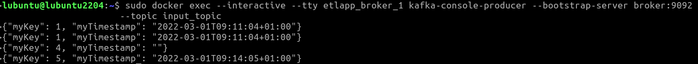
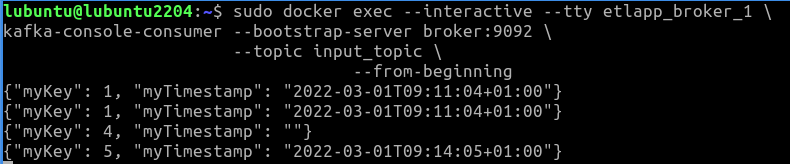
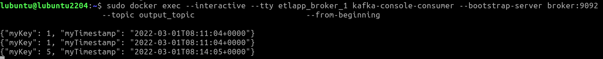

# kafka-etl-app
This application ingests messages from a Kafka topic, processes them and sends to another
Kafka sink topic. Original messages are in the following format-

    {"myKey": 1, "myTimestamp": "2022-03-01T09:11:04+01:00"}

Timestamp field shown above is in a local timezone (e.g. Europe/Berlin) and this app converts
it to UTC time and pushes updated messages to a different Kafka topic in the following format -

    {"myKey": 1, "myTimestamp": "2022-03-01T08:11:04+00:00"}

Timezone conversion logic is generic and can handle any local timezone to UTC conversion. 

### Setup steps
1. First step is to download this source code to a local directory. Also, please make sure 
that local system has docker installed and system is connected to the internet. In a real
production environment, all the necessary libraries will be downloaded from pre built local 
artifactory as the corporate firewalls will block internet connectivity. However, for this 
use case, we assume that this is a sandbox environment where internet access is allowed. 
2. Open a terminal window at the source code directory created in step 1 and execute the 
following command - 

        sudo docker-compose up -d
    
This command will build required images and start the containers. Execute docker command
as shown in the picture below to verify that kafka and application containers are running
as expected.

3. Now that we've got all the required containers running, we need to create input and output 
Kafka topics. Please execute following two commands to achieve this -

        sudo docker exec etlapp_broker_1 \
        kafka-topics --bootstrap-server broker:9092 \
                     --create \
                     --topic input_topic

        sudo docker exec etlapp_broker_1 \
        kafka-topics --bootstrap-server broker:9092 \
                     --create \
                     --topic output_topic

Now setup is ready to ingest and process the messages.

## Test steps
1. First of all, we'll verify if Kafka containers are working as expected. For this, we 
will push some test messages to input topic using Kafka producer and verify if they can be 
consumed by Kafka consumer. Please use the following command to push test messages to the
input topic - 

        sudo docker exec --interactive --tty etlapp_broker_1 \
        kafka-console-producer --bootstrap-server broker:9092 \
                               --topic input_topic
                               
This will start the producer. We can enter/paste test messages to the window as shown in the 
picture below -

In this case, we've entered 4 messages to the window. 

2. Open a different terminal window/tab and start consumer as follows -

        sudo docker exec --interactive --tty etlapp_broker_1 \
        kafka-console-consumer --bootstrap-server broker:9092 \
                               --topic input_topic \                   
                               --from-beginning
                               
As soon as the consumer starts, we should be able to see all the messages sent by the 
producer in the consumer window as shown in the picture below. Notice all the messages
appear in the consumer window exactly same as the original messages published in the 
producer window.

From this time onwards, any new message published by producer will appear in the consumer
window in an automatic fashion. We can close this consumer now by Ctrl+C command. 

3. Now that we've verified producer/consumer workflow is working as expected, we'll check if
our Python application has ingested and processed these messages as well. For this, we can simply 
check if the processed messages have arrived in the output topic (output_topic).

        sudo docker exec --interactive --tty etlapp_broker_1 \
        kafka-console-consumer --bootstrap-server broker:9092 \
                               --topic output_topic \                   
                               --from-beginning
                               

Please notice that messages are processed as expected (all the local timestamps are converted to
UTC and messages without timestamp are dropped and aren't passed to output topic and hence 
they don't appear in this consumer window).
5. To stop the producer we can use Ctrl+D command. 
To stop the containers, we can use the following command - 

            sudo docker stop <container_id> 
    
Container ID can be found from docker ps command as mentioned in te 
