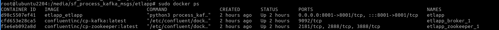
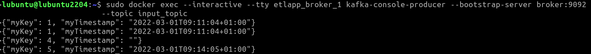
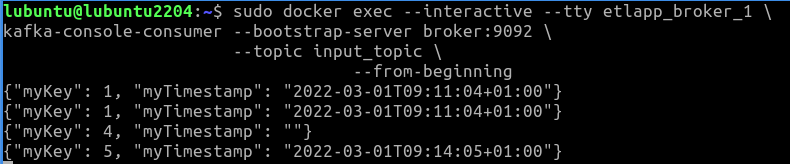

# kafka-etl-app 
(Created by Basant Khati)

This application ingests messages from a Kafka topic, processes them and publishes to another
Kafka sink topic. A couple of sample messages are as follows -

    {"myKey": 1, "myTimestamp": "2022-03-01T09:11:04+01:00"}
    {"myKey": 2, "key2": 15, "key3": "xyz", "key4": 56, "myTimestamp": "2022-03-01T09:14:05+01:00", "key5": 12}

Timestamp fields shown above(for the key "myTimestamp") are in a local timezone (e.g. Europe/Berlin) and this app 
converts them to UTC time and publishes updated messages to a different Kafka topic as follows -

    {"myKey": 1, "myTimestamp": "2022-03-01T08:11:04+00:00"}
    {"myKey": 2, "key2": 15, "key3": "xyz", "key4": 56, "myTimestamp": "2022-03-01T08:14:05+0000", "key5": 12}

Timezone conversion logic is generic and can handle any local timezone to UTC conversion. Any messages with missing 
key "myTimestamp" or with invalid timestamp are dropped.

### Setup steps
1. First step is to download this source code to a local directory. Also, please make sure 
that local system has docker installed and system is connected to the internet. In a real
production environment, all the necessary libraries will be downloaded from pre built local 
artifactory as the corporate firewalls will block internet connectivity. However, for this 
use case, we assume that this is a sandbox environment where internet access is allowed. 
2. Open a terminal window at the source code directory created in step 1 and execute the 
following command - 

        sudo docker-compose up -d
    
   This command will build required images and start the containers. Execute docker command
   as shown in the picture below to verify that kafka and application containers are running
   as expected.

   

3. Now that we've got all the required containers running, we need to create input and output 
Kafka topics. Please execute following two commands to achieve this -

        sudo docker exec etlapp_broker_1 \
        kafka-topics --bootstrap-server broker:9092 \
                     --create \
                     --topic input_topic

        sudo docker exec etlapp_broker_1 \
        kafka-topics --bootstrap-server broker:9092 \
                     --create \
                     --topic output_topic

   Now setup is ready to ingest and process the messages.

### Test the setup
1. First, we'll verify if Kafka containers are working as expected. For this, we 
will push some test messages to input topic using Kafka producer and verify if they can be 
consumed by Kafka consumer. Please use the following command to push test messages to the
input topic - 

        sudo docker exec --interactive --tty etlapp_broker_1 \
        kafka-console-producer --bootstrap-server broker:9092 \
                               --topic input_topic
                               
   This will start the producer. We can enter/paste test messages to the window as shown in the 
picture below -

   

   In this case, we've entered 4 messages to the window. 

2. Open a different terminal window/tab and start consumer as follows -

        sudo docker exec --interactive --tty etlapp_broker_1 \
        kafka-console-consumer --bootstrap-server broker:9092 \
                               --topic input_topic \                   
                               --from-beginning
                               
   As soon as the consumer starts, we should be able to see all the messages sent by the 
   producer in the consumer window as shown in the picture below. Notice all the messages
   appear in the consumer window exactly same as the original messages published in the 
   producer window.

   

   From this time onwards, any new message published by producer will appear in the consumer
   window in an automatic fashion. We can now close the producer with Ctrl+D and consumer with 
   Ctrl+C command. 

### Verify the app with provided script
Source code contains a script verify_etl_app.sh which can be used to verify that the application
works as expected. User only needs to execute this script from a terminal and rest of the process 
is automated. Steps are as follows:
1. Open a terminal in the root directory of this source code in the local system.
2. Execute shell script "verify_etl_app.sh" on the terminal. 

      _This script first starts kafka producer container and publishes some messages from the file 
      "resources/sample_messages.txt" to the topic input_topic. kafka-etl-app in the background consumes 
      these messages from input_topic and processes them while applying appropriate timestamp changes 
      (local timezone to UTC) and publishes to the topic output_topic.
      Next, a consumer is started which reads messages published on output_topic and these messages are
      dumped on an output file "processed_messages.json" separated with new line character._ 
   
3. Script will print how many messages got processed before exiting. Afterwards, one can open the
   output file "processed_messages.txt" and compare it with the contents of original file 
   "resources/sample_messages.txt". One should notice that all the timestamps associated with key 
   "myTimestamp" are transformed from local time to UTC time. Also, any invalid (non json) messages
   or messages without "myTimestamp" key or malformed timestamp will be dropped and won't appear in
   the output file.

4. To stop the producer we can use Ctrl+D command. 
To stop the containers, we can use the following command - 

            sudo docker stop <container_id> 
    
Container ID can be found from docker ps command as mentioned in step (2) of Setup steps.
